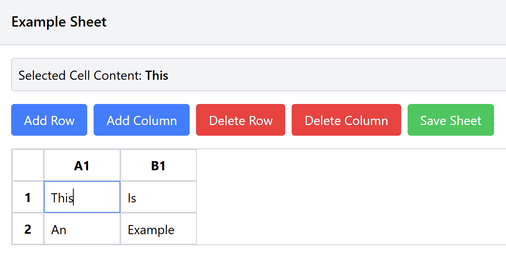

# **Spreadsheet App - Swiftly Internship Assignment**

This is a simple spreadsheet application built using **React, Node, Express and MongoDB** as part of internship recruitment process for the Swifly project at **FranTiger Consulting**. The application allows users to interact with a spreadsheet, save its state, and load it back. Below are the instructions to set up and run the project locally.



## **Setup Instructions** 

## **1. Clone the Repository**  
```sh
git clone https://github.com/prag-z/speadsheet-app-swifly-assignment.git
cd spreadsheet-app-swifly-assignment
```

## **2. Backend Setup**

### **2.1 Navigate to Backend Directory**
```sh
cd backend
```

### **2.2 Install Dependencies**
```sh
npm install
```

### **2.3 Configure Environment Variables**
Create a `.env` file inside the `backend` directory and add the following:
```sh
MONGO_URI=<mongodb_connection_string>
```

### **2.4 Start the Backend Server**
```sh
node index.js
```

The backend will have started on `http://localhost:5000`


## **3. Frontend Setup**

### **2.1 Navigate to Frontend Directory**
Create a new instance of the terminal. Then enter the command:
```sh
cd frontend
```

### **2.2 Install Dependencies**
```sh
npm install
```

### **2.3 Start the Frontend**
```sh
npm run dev
```

The frontend will have started on `http://localhost:3000`


## **Notes**
This application only supports a single instance of a spreadsheet. The state of the sheet is saved and overwritten upon clicking the "Save" button. Ensure the work is saved before closing the application instance.


